# Microsoft 365 & Entra ID Administration Lab

## Project Overview

This project demonstrates the creation and administration of a simulated business environment using Microsoft 365 and Microsoft Entra ID.

The lab was designed to replicate common responsibilities performed by IT Support, Help Desk, and Microsoft 365 administrators in a real-world organization. The environment includes user provisioning, security group management, license administration, password resets, multi-factor authentication (MFA), Conditional Access, Microsoft Teams policies, shared mailboxes, external email warnings, employee offboarding, and administrative monitoring.

Rather than focusing only on initial configuration, the project follows the lifecycle of users within the environment — from account creation and access assignment through security configuration, support operations, and eventual offboarding.

## Technologies & Services Used

- Microsoft 365 Admin Center
- Microsoft Entra ID
- Microsoft Exchange Admin Center
- Microsoft Teams Admin Center
- Microsoft 365 Groups and Security Groups
- Microsoft Entra Conditional Access
- Multi-Factor Authentication (MFA)
- Shared Mailboxes
- Exchange Mail Flow Rules
- Microsoft Entra Sign-In Logs
- Microsoft Entra Audit Logs

## Skills Demonstrated

- Microsoft 365 tenant administration
- Microsoft Entra ID user and identity management
- User account provisioning and deprovisioning
- Microsoft 365 license assignment
- Security group creation and membership management
- Password reset and account recovery administration
- Multi-factor authentication configuration
- Conditional Access policy configuration
- Microsoft Teams policy administration
- Shared mailbox creation and delegation
- Exchange mail flow rule configuration
- Employee onboarding and offboarding
- Session revocation and account disabling
- Sign-in monitoring and authentication troubleshooting
- Administrative audit log investigation
- Identity lifecycle management
- Security-focused Microsoft 365 administration

---

## Lab Scenario

For this project, I created a simulated Microsoft 365 business environment to practice administering users, groups, security controls, collaboration services, and identity lifecycle operations.

The environment was structured to represent a small organization with multiple users and departments. Throughout the lab, I performed common administrative tasks that an IT professional may encounter while supporting a Microsoft 365 environment.

The project begins with the creation and configuration of users and security groups. From there, additional administrative controls are introduced, including license management, password resets, MFA, Conditional Access, Microsoft Teams policies, shared mailboxes, and Exchange mail flow rules.

The final stages of the project demonstrate the employee offboarding process, including removing group memberships, revoking active sessions, disabling the user account, and verifying the changes through Microsoft Entra ID audit and sign-in logs.

Sensitive tenant information and personally identifiable information shown in the original administrative environment were removed or excluded from the public project documentation.

---

## Project Parts

The lab is documented through the following parts:

1. **Microsoft 365 Environment Setup**
2. **User Creation & Onboarding**
3. **Groups & Department Organization**
4. **User & License Management**
5. **Password Reset & Account Troubleshooting**
6. **Entra ID, MFA & Security**
7. **Teams Administration**
8. **Exchange & Shared Mailbox Administration**
9. **Employee Offboarding**
10. **Sign-In Monitoring & Audit Verification**

Each part below documents the administrative objective, implementation process, and verification of the completed configuration.

---

## Part 1 — Microsoft 365 Environment Setup

### Objective

The first part of the project focused on establishing and reviewing the Microsoft 365 administrative environment that would be used throughout the lab.

Microsoft 365 provides centralized cloud-based administration for organizational identities, licenses, collaboration services, and security settings. Before beginning user provisioning and access management, I reviewed the Microsoft 365 Admin Center to become familiar with the tenant and the administrative tools available for managing the environment.

The tenant served as the foundation for the remainder of the project, including user and group administration, licensing, authentication security, Microsoft Teams, Exchange Online, employee offboarding, and activity monitoring.

---

### Microsoft 365 Admin Center

I accessed the **Microsoft 365 Admin Center**, which served as the primary administrative portal for managing the organization's Microsoft 365 environment.

The admin center provides access to several core administrative functions, including:

- User and identity management
- Group administration
- Microsoft 365 license management
- Microsoft Teams and Exchange administration
- Security and identity settings
- Administrative roles
- Service configuration and monitoring

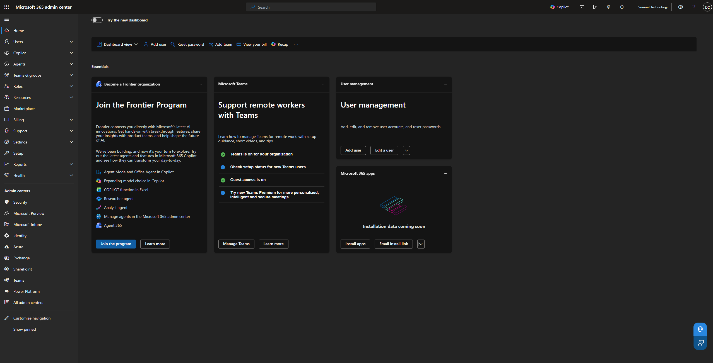

---

### Administrative Environment

The Microsoft 365 tenant was used as a simulated business environment throughout the project. Administrative tasks were performed across the Microsoft 365 Admin Center and specialized management portals such as **Microsoft Entra ID**, the **Microsoft Teams Admin Center**, and the **Exchange Admin Center**.

Using these interconnected administrative tools allowed the environment to support the complete user lifecycle demonstrated later in the project—from initial account creation and access assignment through security configuration, collaboration services, troubleshooting, offboarding, and audit verification.

---

### Part 1 Outcome

At the completion of this part, I had:

- Established access to the Microsoft 365 administrative environment
- Reviewed the primary Microsoft 365 management interface
- Identified the administrative services required throughout the project
- Established the cloud environment used for subsequent identity, security, collaboration, and user lifecycle administration

With the Microsoft 365 environment established, the next step was to begin provisioning employee identities and configuring user accounts.

---

## Part 2 — User Creation & Onboarding

### Objective

The second part of the project focused on provisioning a new employee account within the Microsoft 365 environment.

User onboarding is a core responsibility for Microsoft 365 administrators because each employee requires an organizational identity before access to licenses, groups, applications, and collaboration resources can be assigned.

For this part, I used the **Microsoft 365 Admin Center** to configure a new employee account, review the account settings, and verify that the identity was successfully created within the tenant.

---

### Reviewing the New User Configuration

Using the **Microsoft 365 Admin Center**, I began the process of adding a new employee to the organization.

Before completing the account creation process, I reviewed the user's configuration to verify that the information entered for the new identity was correct.

This review step is important during employee onboarding because incorrect account information can affect usernames, organizational information, licensing, group membership, and access to company resources.

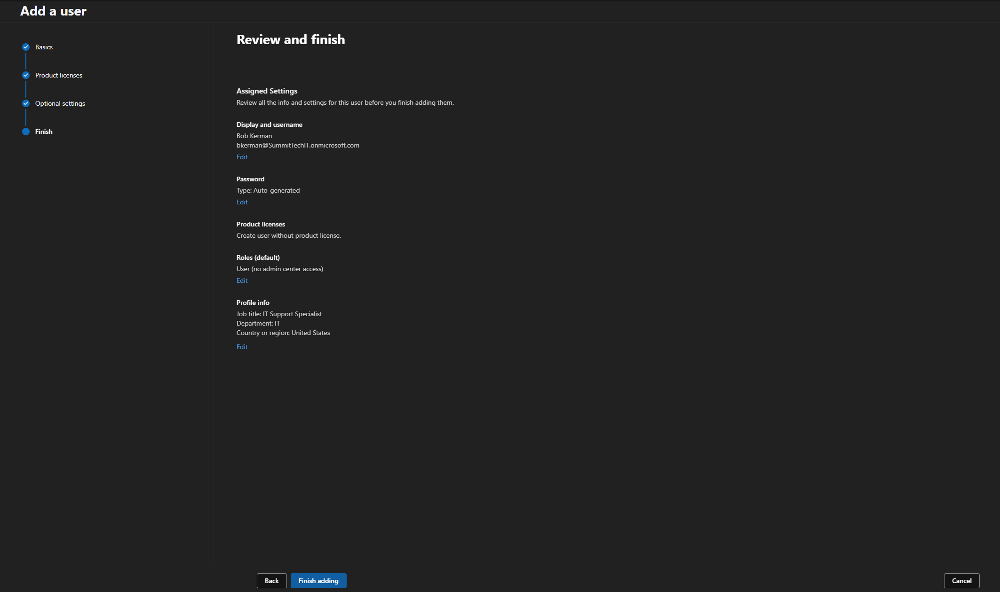

---

### Verifying Successful User Creation

After reviewing the configuration, I completed the account creation process.

Microsoft 365 confirmed that the new user had been successfully added to the organization, verifying that the employee now had an identity within the tenant.

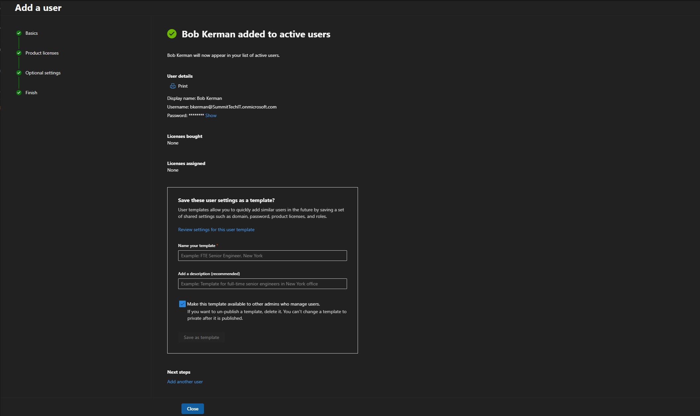

The newly provisioned identity could now be managed through the Microsoft 365 environment and used for subsequent administrative tasks such as group assignment, licensing, authentication configuration, and access management.

---

### Part 2 Outcome

At the completion of this part, I had:

- Provisioned a new employee identity in Microsoft 365
- Reviewed the user configuration before account creation
- Verified that the account was successfully created
- Established the identity required for subsequent access and service configuration

With the employee account provisioned, the next step was to organize users and access through security groups and department-based membership.

---

## Part 3 — Groups & Department Organization

### Objective

The third part of the project focused on organizing users through security groups within the Microsoft 365 environment.

Groups allow administrators to manage access and membership collectively rather than configuring permissions individually for every employee. This becomes increasingly important as an organization grows because users can be organized according to departments, job functions, or access requirements.

For this part, I created department-based security groups, assigned users to their appropriate departments, and verified the completed group structure.

---

### Creating the IT Department Security Group

Using the **Microsoft 365 Admin Center**, I created a security group named **IT Department** to represent the organization's IT personnel.

The group was configured with a clear departmental purpose, providing a structured way to organize employees and support future access or resource assignments based on job function.

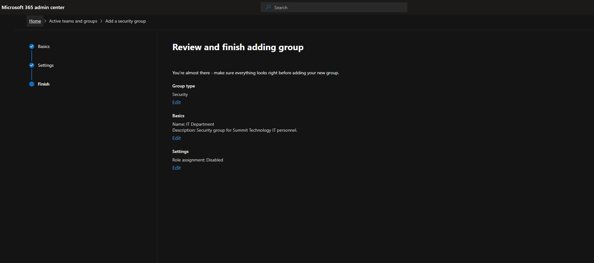

---

### Verifying Group Creation

After reviewing the configuration, I completed the group creation process.

Microsoft 365 confirmed that the **IT Department** security group had been successfully created and would become available within the organization's active groups.

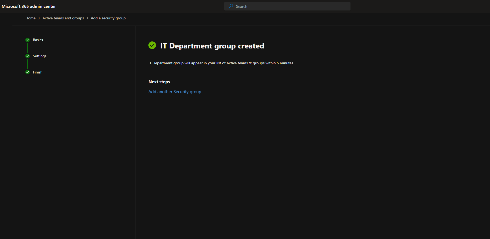

---

### Assigning a User to the Security Group

Once the IT Department group was available, I opened its membership settings and selected the appropriate employee account.

**Bob Kerman**, whose role was associated with the IT department, was selected for membership in the security group.

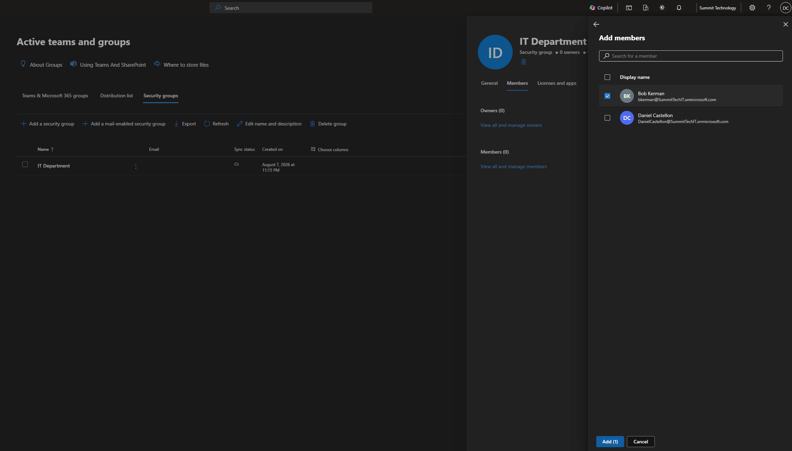

---

### Verifying Security Group Membership

After completing the membership assignment, I reviewed the IT Department group to verify that the employee had been added successfully.

The group displayed **Bob Kerman** as a member, confirming that the departmental membership configuration had been applied correctly.

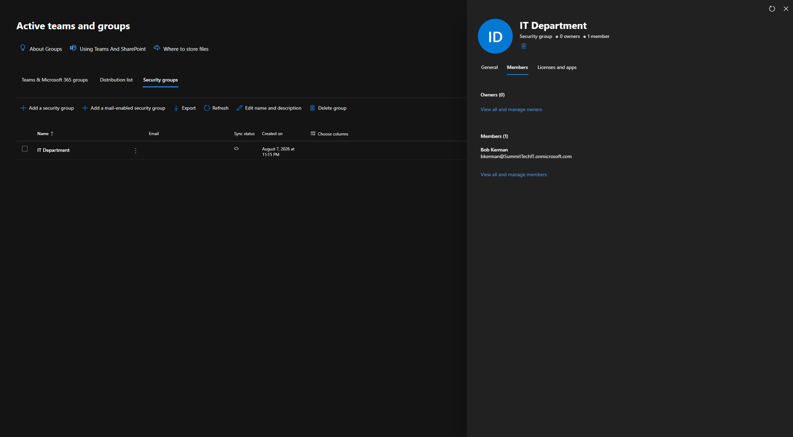

---

### Reviewing Department Assignments

The active user directory was then reviewed to confirm that employee accounts were associated with their appropriate organizational departments.

The environment included users assigned to **Sales, IT, Finance, and Human Resources**, creating a more realistic organizational structure for continued Microsoft 365 administration.

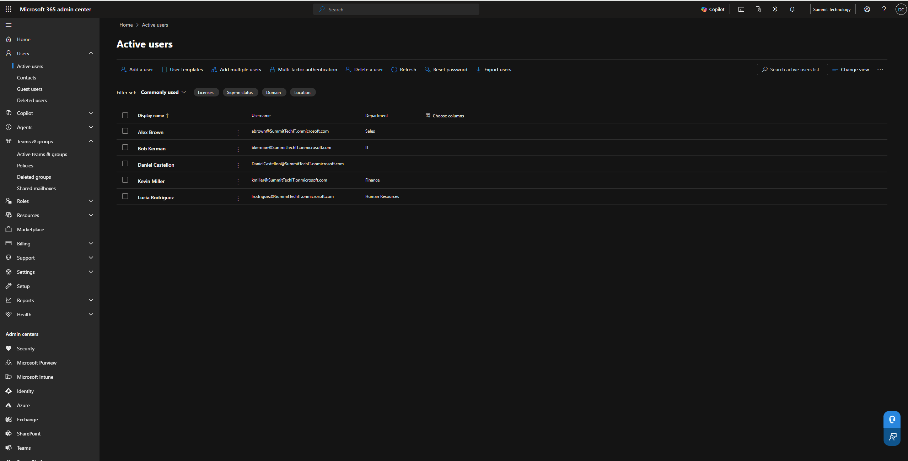

---

### Verifying the Department Group Structure

The same organizational approach was applied to the remaining departments.

Separate security groups were established for **Finance, Human Resources, IT, and Sales**, with employees assigned according to their respective departments.

The Finance Department group, for example, shows **Kevin Miller** as a member, demonstrating that the department-based group structure was successfully implemented across the environment.

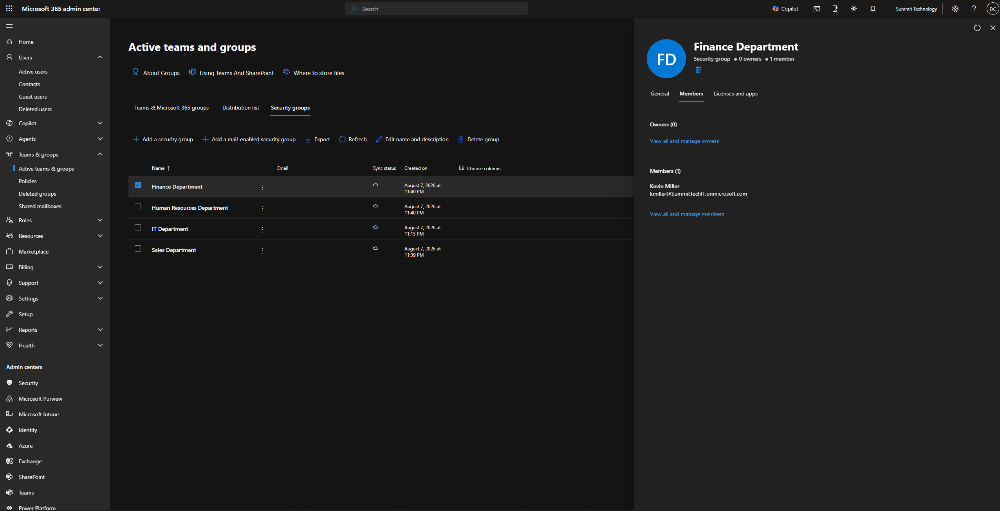

---

### Part 3 Outcome

At the completion of this part, I had:

- Created department-based security groups
- Configured the IT Department security group
- Assigned an employee to the appropriate department group
- Verified security group membership
- Organized employees according to department
- Established separate groups for Sales, IT, Finance, and Human Resources
- Demonstrated a scalable approach to organizational user management

With the employee accounts organized into their appropriate department groups, the next part focused on **user account and Microsoft 365 license management**.

---

## Part 4 — User & License Management

### Objective

The fourth part of the project focused on managing individual Microsoft 365 user accounts and reviewing the licensing assigned to employees within the organization.

For this part, I reviewed Microsoft 365 license availability and accessed an individual employee account to examine its administrative and licensing configuration.

---

### Reviewing Microsoft 365 Licensing

Using the **Microsoft 365 Admin Center**, I reviewed the organization's available Microsoft 365 licenses and their current assignment status.

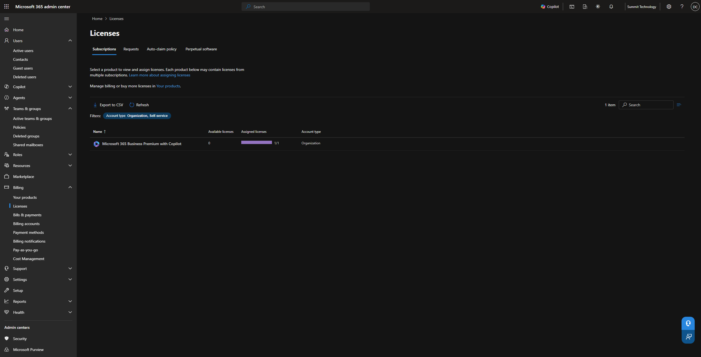

---

### Managing an Individual User Account

I opened an individual employee account to review its account information, assigned license, and available administrative management options.

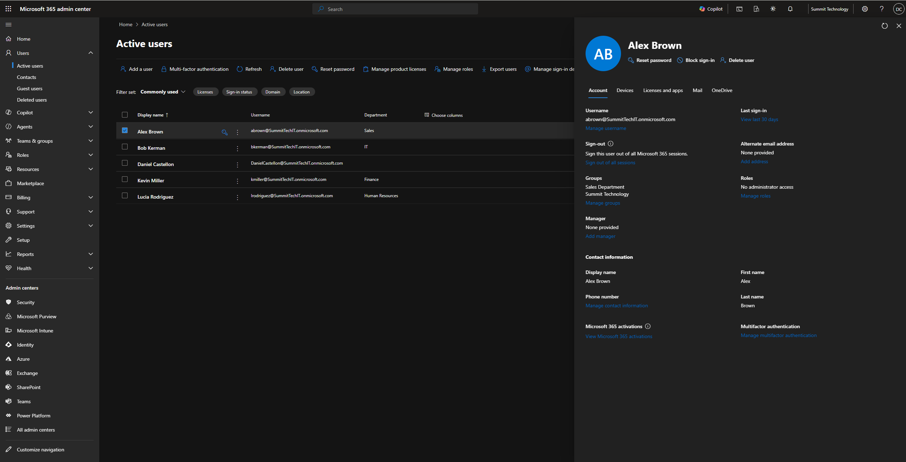

---

### Part 4 Outcome

At the completion of this part, I had:

- Reviewed Microsoft 365 license availability and assignment
- Accessed an individual employee account for administration
- Reviewed the user's assigned Microsoft 365 license
- Demonstrated centralized user and license management through the Microsoft 365 Admin Center

With the user's account and licensing configuration reviewed, the next part focused on **password reset and account troubleshooting**.

---

## Part 5 — Password Reset & Account Troubleshooting

### Objective

The fifth part of the project focused on performing a common help desk task by resetting a user's password through the Microsoft 365 Admin Center.

For this scenario, I initiated an administrator password reset and verified that Microsoft 365 successfully generated new credentials for the employee account.

---

### Configuring the Password Reset

Using the user's account management options, I initiated a password reset and configured Microsoft 365 to generate a new temporary password for the employee.

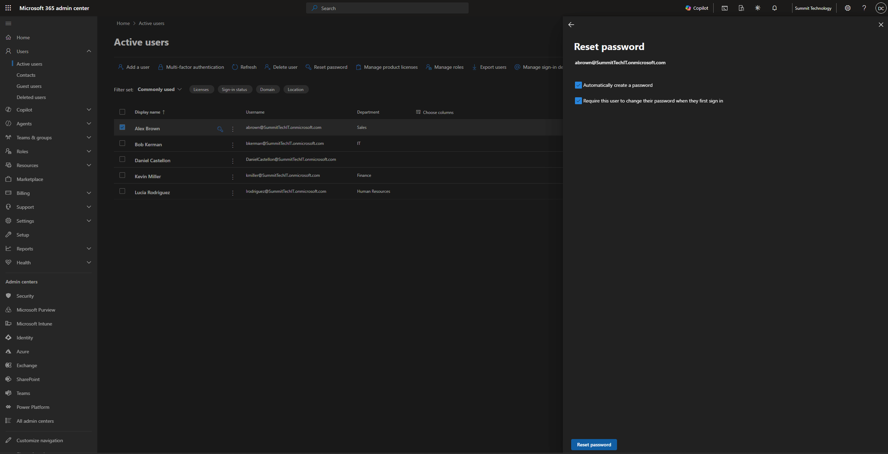

---

### Verifying the Password Reset

Microsoft 365 confirmed that the password reset was completed successfully and generated new credentials for the user account.

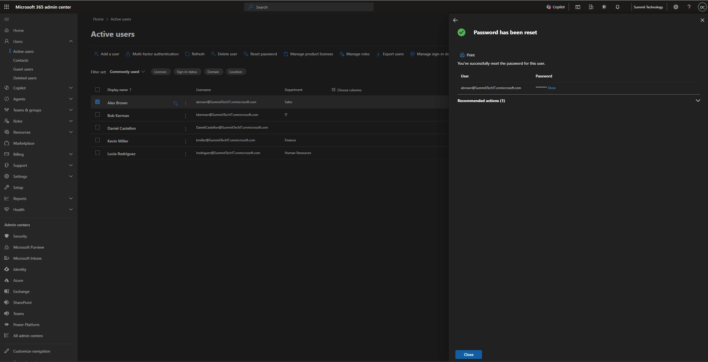

---

### Part 5 Outcome

At the completion of this part, I had:

- Initiated an administrator password reset
- Generated temporary credentials for the user
- Verified that the password reset completed successfully
- Demonstrated a common Microsoft 365 account recovery and help desk workflow

With the account recovery process completed, the next part focused on **Microsoft Entra ID, Multi-Factor Authentication, and Conditional Access security**.

---

## Part 6 — Entra ID, MFA & Security

### Objective

The sixth part of the project focused on strengthening identity security using **Microsoft Entra ID**, **Multi-Factor Authentication (MFA)**, and **Conditional Access**.

For this part, I selected users for an MFA requirement, configured the policy to protect cloud resources, required MFA as an access control, and verified that the completed Conditional Access policy was successfully created.

---

### Reviewing Users in Microsoft Entra ID

Using **Microsoft Entra ID**, I reviewed the user directory before configuring additional identity and authentication security controls.

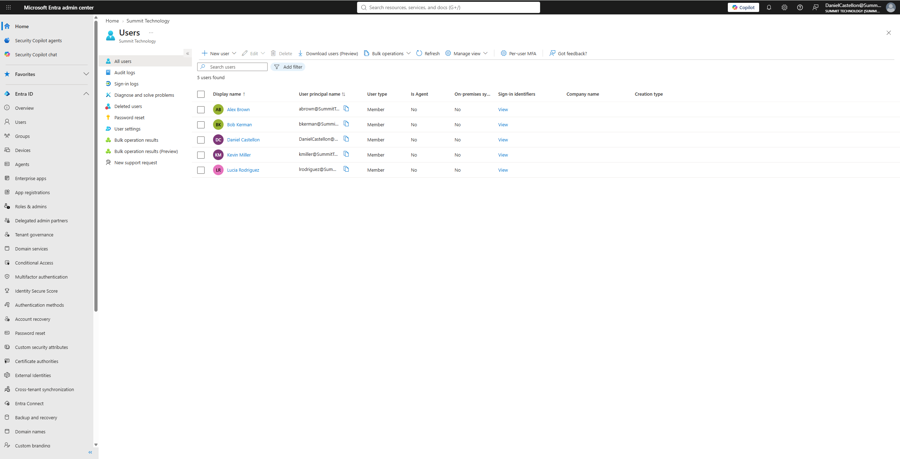

---

### Selecting Users for MFA

I configured the Conditional Access policy to apply to the selected users who would be required to complete multi-factor authentication.

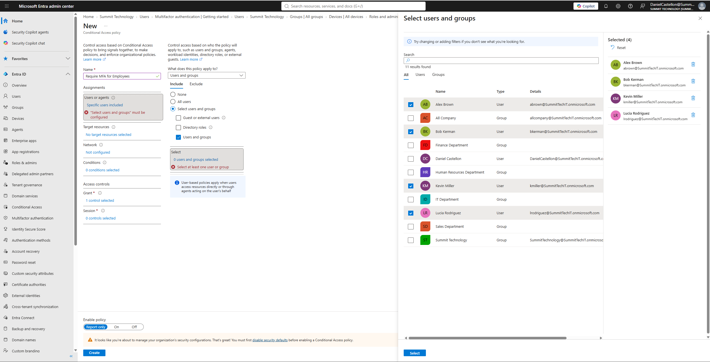

---

### Selecting Cloud Resources

The Conditional Access policy was configured to apply to the selected Microsoft cloud resources accessed by the targeted users.

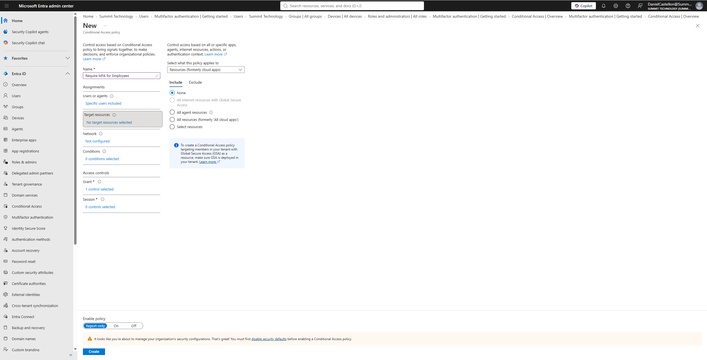

---

### Requiring Multi-Factor Authentication

Under the policy's access controls, I configured **Require multifactor authentication** as the condition that users must satisfy before access is granted.

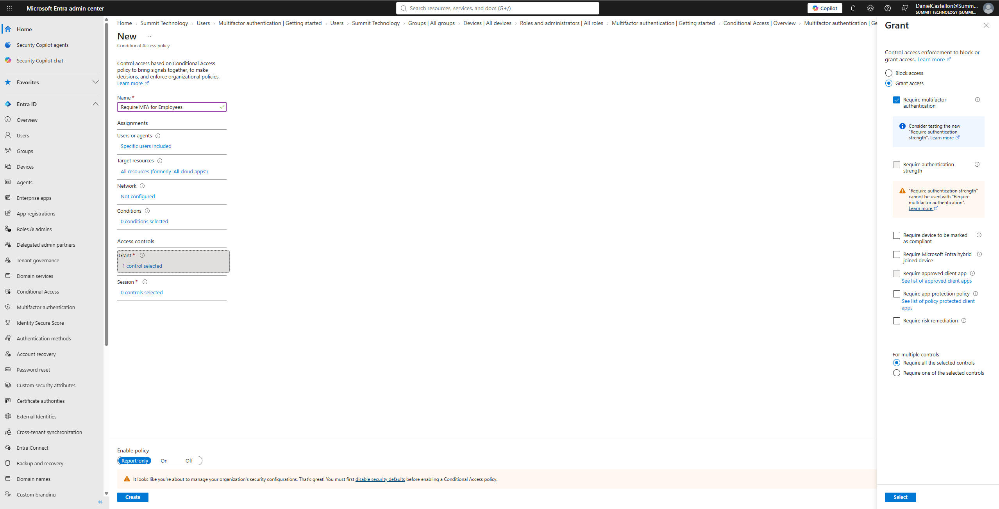

---

### Verifying the Conditional Access Policy

After completing the configuration, I verified that the MFA Conditional Access policy had been successfully created and enabled.

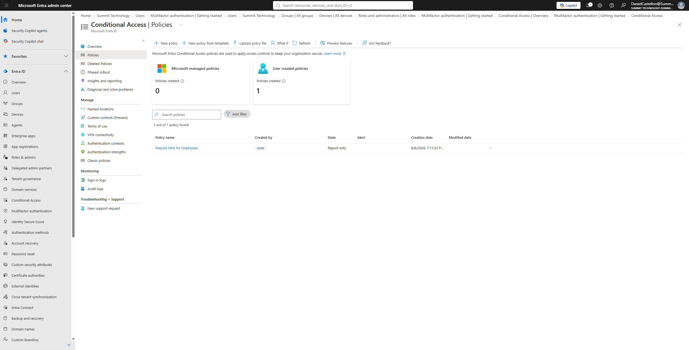

---

### Part 6 Outcome

At the completion of this part, I had:

- Navigated and managed users through Microsoft Entra ID
- Selected users to receive an MFA requirement
- Applied Conditional Access controls to Microsoft cloud resources
- Configured MFA as a requirement for access
- Created and verified an active Conditional Access policy

With the identity security controls configured, the next part focused on **Microsoft Teams administration and collaboration management**.

---

## Part 7 — Teams Administration

### Objective

The seventh part of the project focused on administering **Microsoft Teams** to support department-based communication and collaboration within the organization.

For this part, I created a Sales Department team, added an employee as a member, configured a dedicated channel, and created and assigned a custom Teams policy to multiple users.

---

### Creating the Sales Department Team

Using the **Microsoft Teams Admin Center**, I created a new team named **Sales Department** to provide a dedicated collaboration environment for employees within the department.

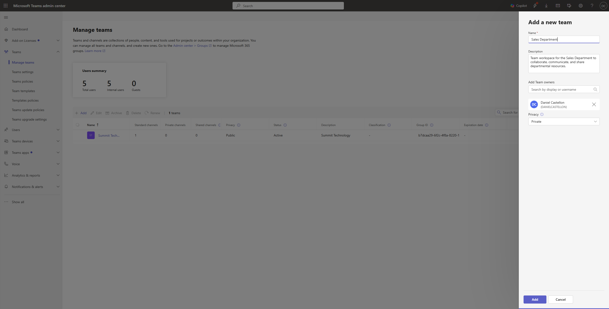

---

### Verifying Team Creation

After completing the configuration, I verified that the **Sales Department** team was successfully created and available within the Teams Admin Center.

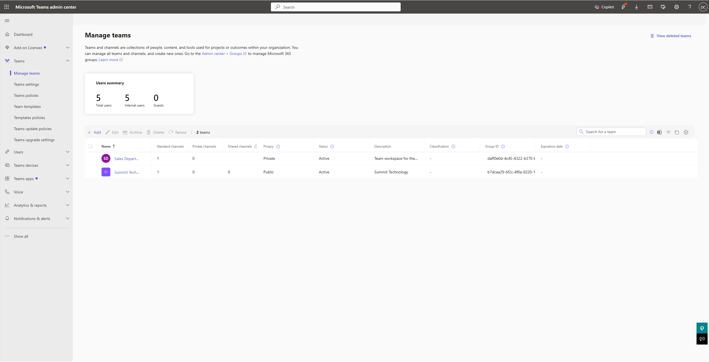

---

### Adding a Team Member

I added **Alex Brown** to the Sales Department team to provide the user with access to the department's Teams collaboration resources.

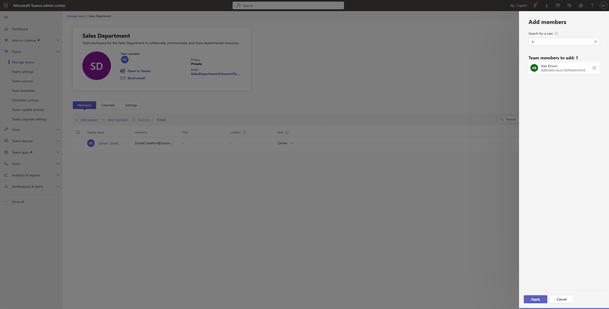

---

### Verifying Team Membership

I reviewed the team's membership to confirm that **Alex Brown** had been successfully added to the Sales Department team.

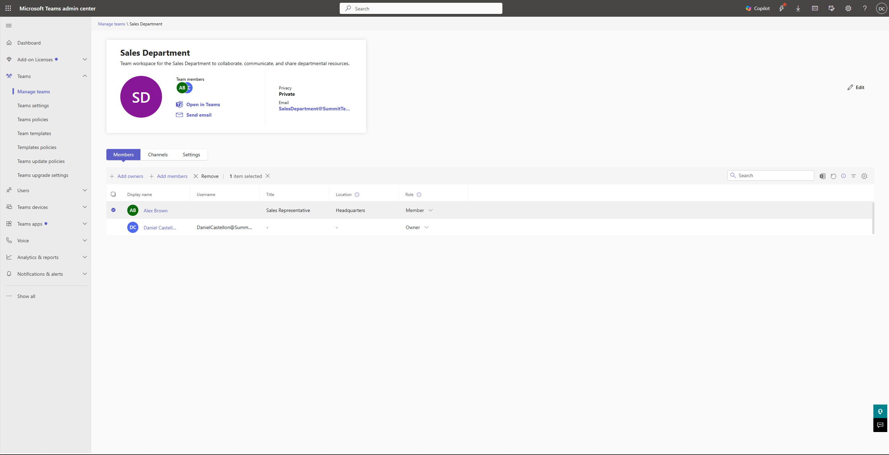

---

### Creating a Department Channel

Within the Sales Department team, I created a standard channel named **Sales Operations** to provide a dedicated workspace for department-specific communication and collaboration.

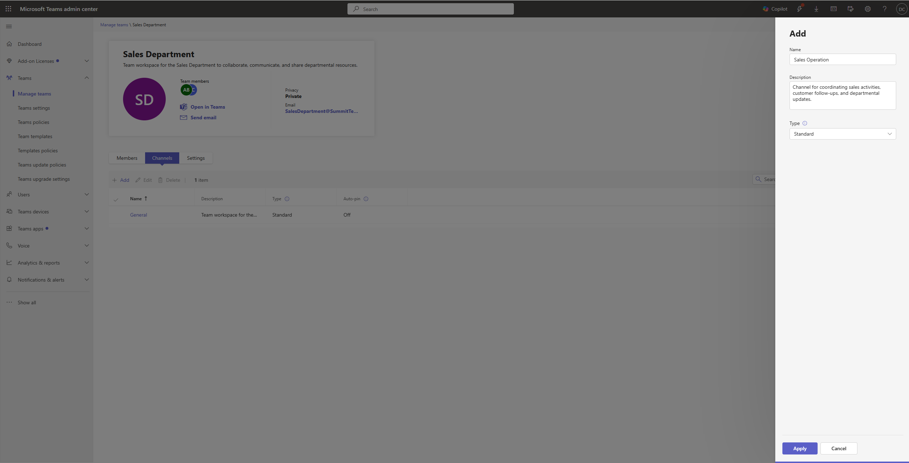

---

### Verifying the Sales Operations Channel

I verified that the **Sales Operations** channel was successfully created and available within the Sales Department team.

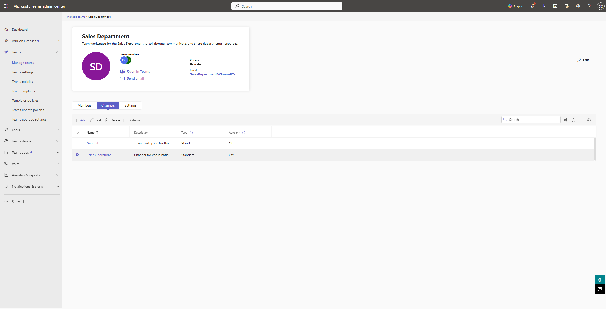

---

### Creating a Teams Policy

Using the Teams Admin Center, I created a custom **Employee Teams Policy** to demonstrate centralized policy management for organizational users.

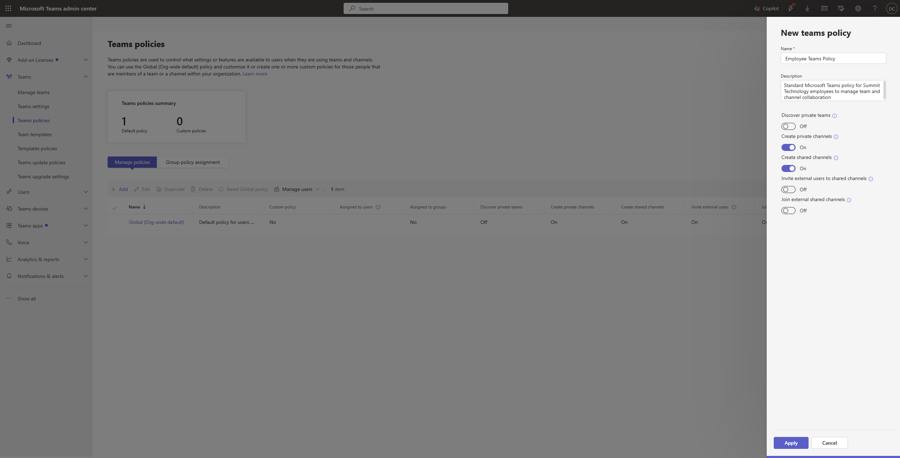

---

### Configuring the Teams Policy

I configured the Employee Teams Policy settings to define the Teams features and capabilities available to users assigned to the policy.

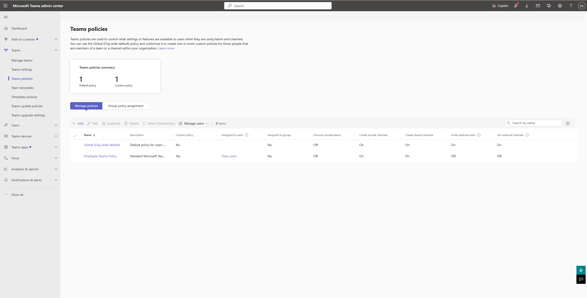

---

### Assigning the Teams Policy

I assigned the custom Employee Teams Policy to multiple employee accounts so that the configured settings could be managed consistently across the selected users.

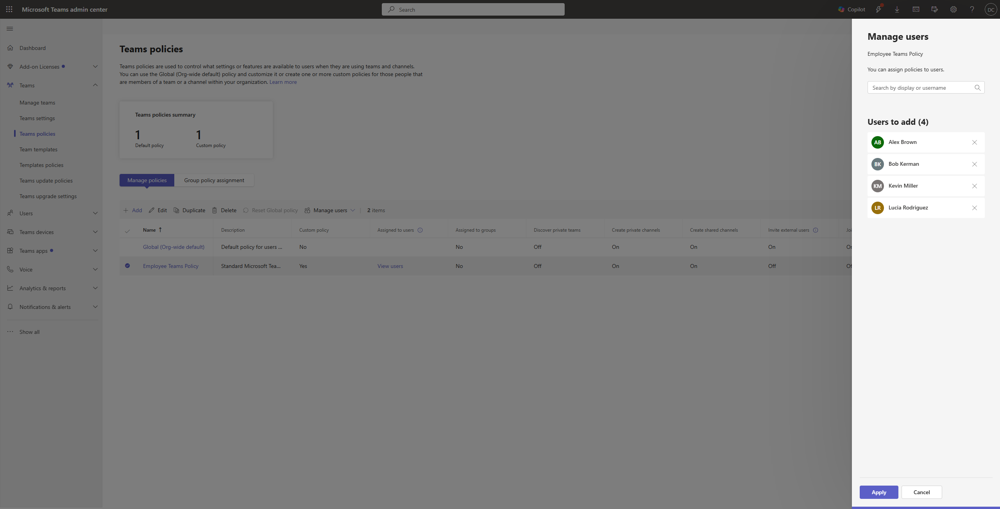

---

### Verifying Policy Assignment

I verified that the selected employee accounts had been successfully assigned to the **Employee Teams Policy**.

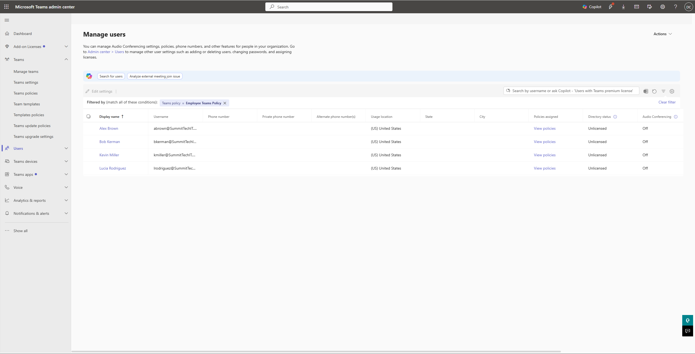

---

### Part 7 Outcome

At the completion of this part, I had:

- Created and verified a department-based Microsoft Team
- Added and verified an employee as a team member
- Created a dedicated Sales Operations channel
- Created and configured a custom Teams policy
- Assigned the policy to multiple employee accounts
- Verified successful policy assignment through the Teams Admin Center

With the organization's Teams environment configured, the next part focused on **Exchange Online and shared mailbox administration**.

---

## Part 8 — Exchange & Shared Mailbox Administration

### Objective

The eighth part of the project focused on administering **Exchange Online** to configure shared email resources and improve visibility of messages originating outside the organization.

For this part, I created an IT Support shared mailbox, configured mailbox delegation, and implemented an Exchange mail flow rule that adds a warning to external email messages.

---

### Creating the IT Support Shared Mailbox

Using the **Exchange Admin Center**, I created an **IT Support** shared mailbox to provide a centralized email resource that could be accessed by authorized IT personnel.

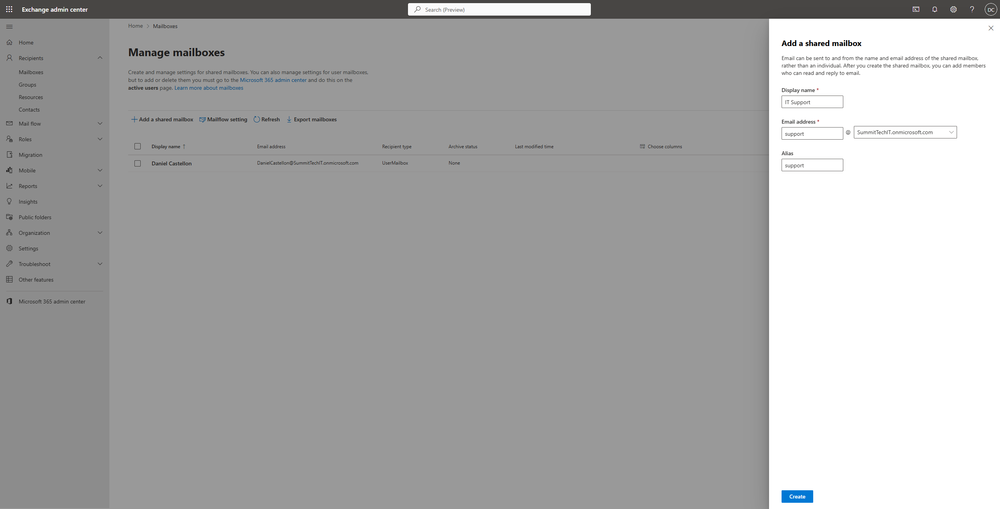

---

### Verifying Shared Mailbox Creation

I verified that the **IT Support** shared mailbox had been successfully created and was available within the Exchange Admin Center.

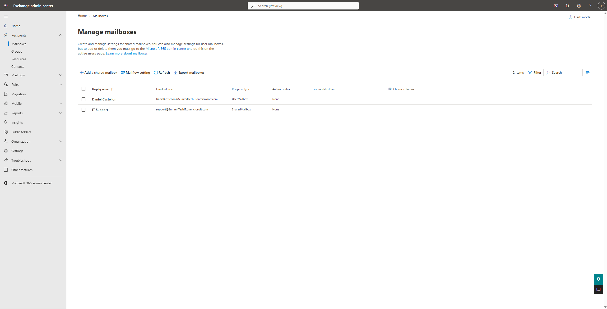

---

### Reviewing Shared Mailbox Settings

I opened the IT Support shared mailbox to review its configuration and access the available mailbox management settings.

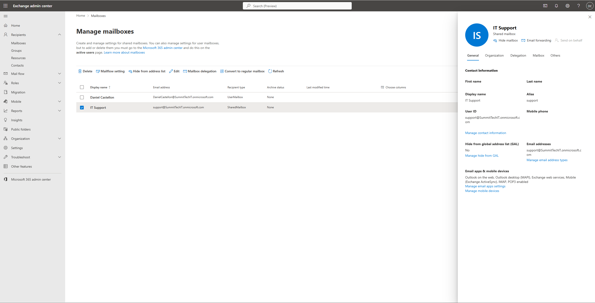

---

### Reviewing Mailbox Delegation

Before assigning access, I reviewed the mailbox delegation settings to confirm the existing permissions for the IT Support shared mailbox.

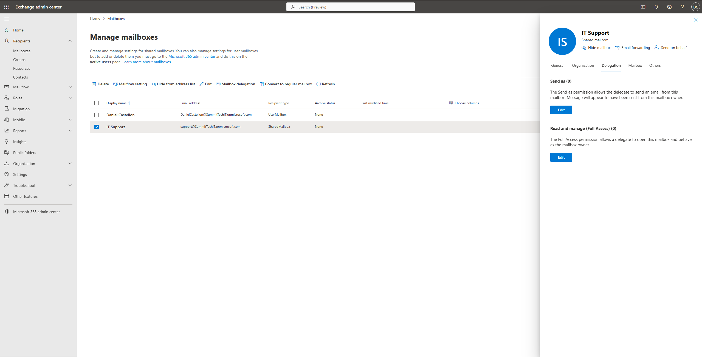

---

### Assigning Full Access

I assigned **Full Access** permission to the appropriate user so the employee could open and manage the IT Support shared mailbox.

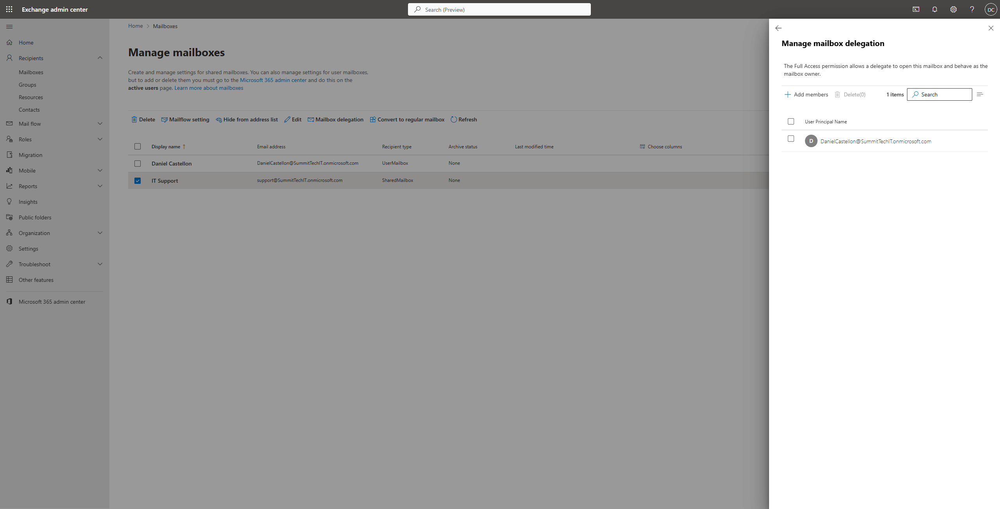

---

### Configuring an External Email Warning

Using Exchange mail flow rules, I configured an **External Email Warning** to display a caution message when an email originates from outside the organization.

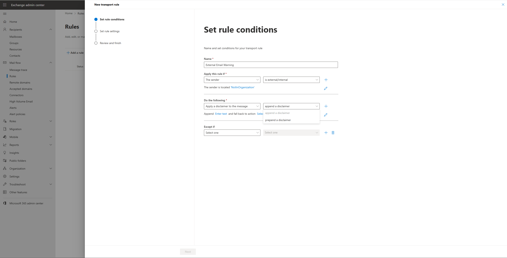

---

### Creating the Mail Flow Rule

I completed the configuration and verified that the **External Email Warning** mail flow rule was successfully created within Exchange Online.

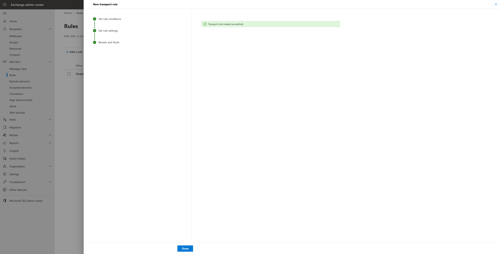

---

### Enabling the External Email Warning

I enabled the External Email Warning rule in **Enforce** mode so the configured warning would be applied to messages received from external senders.

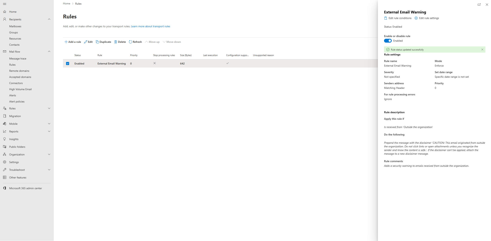

---

### Part 8 Outcome

At the completion of this part, I had:

- Created and verified an IT Support shared mailbox
- Reviewed the shared mailbox configuration
- Configured mailbox delegation and Full Access permissions
- Created an Exchange mail flow rule for external email
- Configured an external sender warning message
- Enabled and verified the mail flow rule in Enforce mode

With the Exchange environment configured, the next part focused on the **employee offboarding process and removal of organizational access**.

---

## Part 9 — Employee Offboarding

### Objective

The ninth part of the project focused on securely offboarding an employee by removing access to organizational resources and preventing further account use.

For this part, I reviewed the user's existing access, signed out active Microsoft 365 sessions, blocked future sign-ins, removed group memberships, and verified the final account state.

---

### Reviewing the Pre-Offboarding Account State

Before making any changes, I reviewed **Alex Brown's** account to document the user's current access and group memberships.

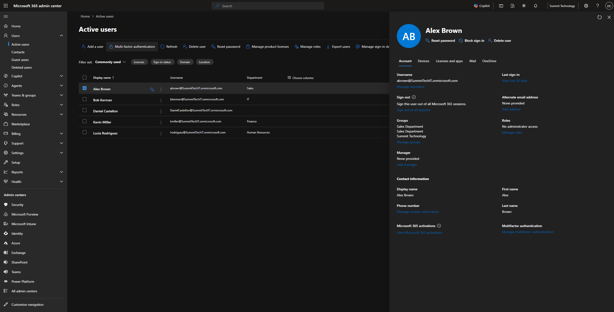

---

### Signing Out Active Sessions

I initiated a Microsoft 365 session sign-out to invalidate the user's existing authenticated sessions as part of the offboarding process.

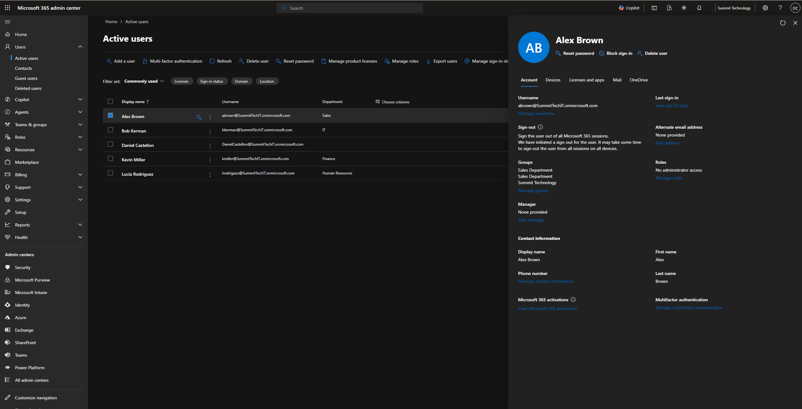

---

### Blocking User Sign-In

I blocked sign-in for Alex Brown's account to prevent the user from authenticating and regaining access to Microsoft 365 services.

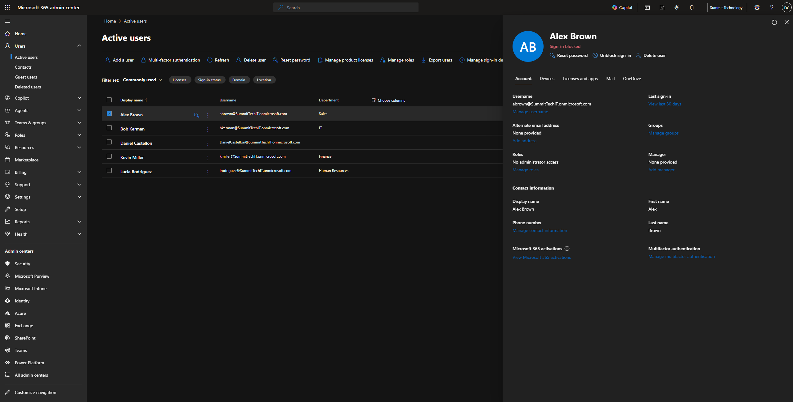

---

### Removing Sales Department Membership

I removed Alex Brown from the **Sales Department** group to revoke department-based access associated with the user's previous role.

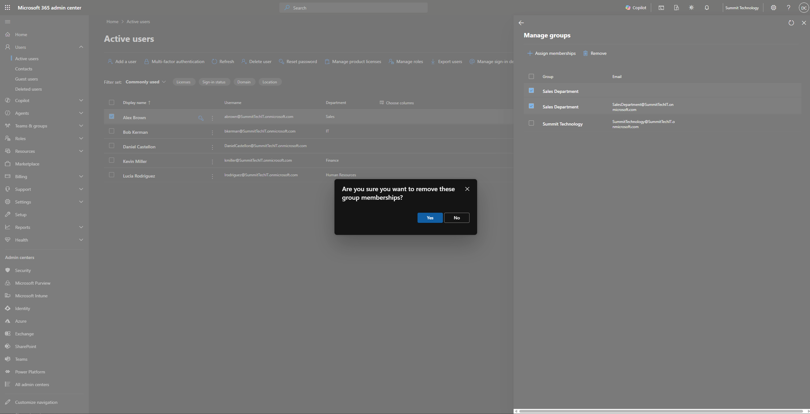

---

### Removing Remaining Organizational Membership

I removed Alex Brown from the **Summit Technology** group to eliminate the user's remaining organizational group membership.

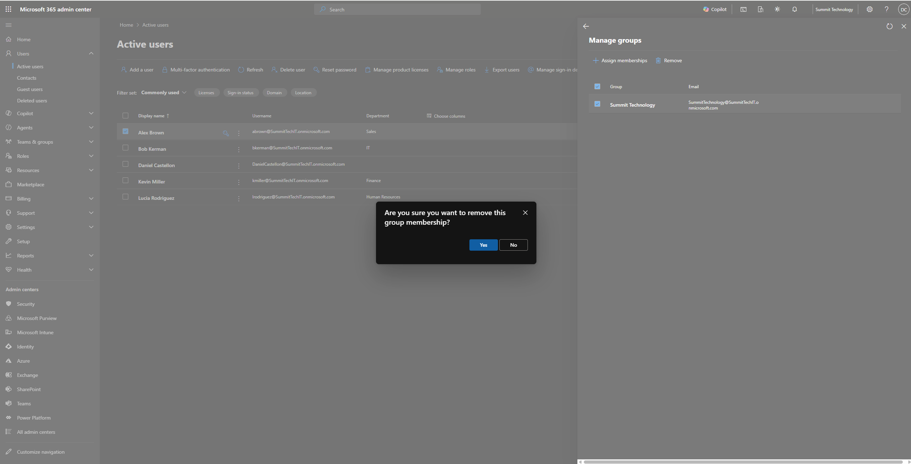

---

### Verifying the Final Account State

I reviewed the account after completing the offboarding actions and confirmed that sign-in was blocked and the previous group memberships had been removed.

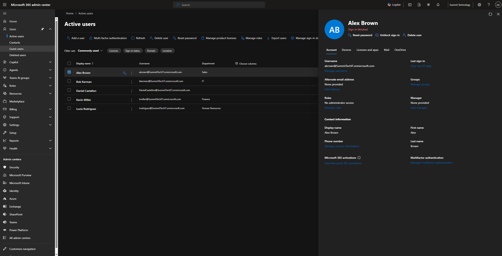

---

### Part 9 Outcome

At the completion of this part, I had:

- Reviewed the user's access before offboarding
- Signed the user out of active Microsoft 365 sessions
- Blocked future account sign-ins
- Removed department and organizational group memberships
- Verified the user's final offboarded account state
- Demonstrated a complete Microsoft 365 employee offboarding workflow

With the employee account successfully offboarded, the final part focused on **sign-in monitoring and audit verification through Microsoft Entra ID**.

---

## Part 10 — Sign-In Monitoring & Audit Verification

### Objective

The final part of the project focused on using **Microsoft Entra ID** to review sign-in activity, authentication security, and administrative audit logs.

For this part, I reviewed recent sign-in events, examined the security controls applied during authentication, and used audit logs to verify that the account disable action performed during offboarding was successfully recorded.

---

### Reviewing Sign-In Activity

Using **Microsoft Entra ID**, I reviewed recent sign-in events to examine authentication activity, application access, sign-in status, and Conditional Access results.

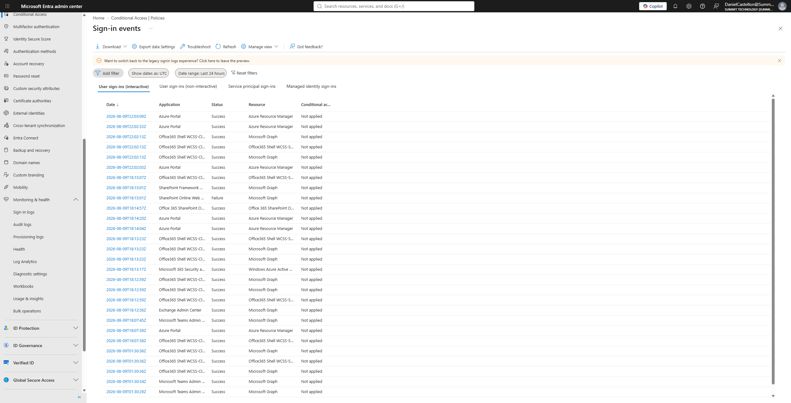

---

### Reviewing Authentication Security

I examined the authentication details of a successful sign-in and verified that **Security Defaults** applied an MFA grant control during the authentication process.

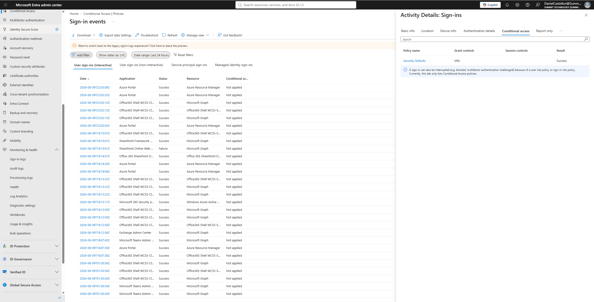

---

### Verifying the Account Disable Action

Finally, I reviewed the **Microsoft Entra audit logs** and confirmed that the offboarded user's AccountEnabled property changed from true to false, providing an audit record of the account disable action.

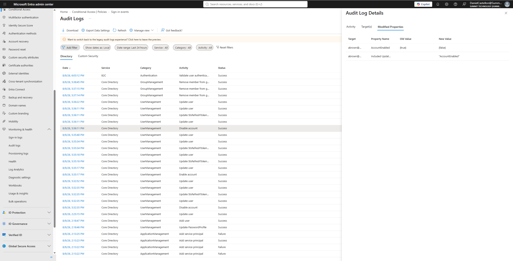

---

### Part 10 Outcome

At the completion of this part, I had:

- Reviewed Microsoft Entra sign-in activity
- Examined authentication and Conditional Access information
- Verified that MFA security controls were applied during authentication
- Reviewed administrative activity through Microsoft Entra audit logs
- Confirmed the account disable action performed during employee offboarding
- Demonstrated the ability to use identity logs to verify administrative changes

This completed the Microsoft 365 administration project, covering the user lifecycle from initial environment setup and employee onboarding through access management, security configuration, collaboration services, Exchange administration, employee offboarding, and final audit verification.

---
